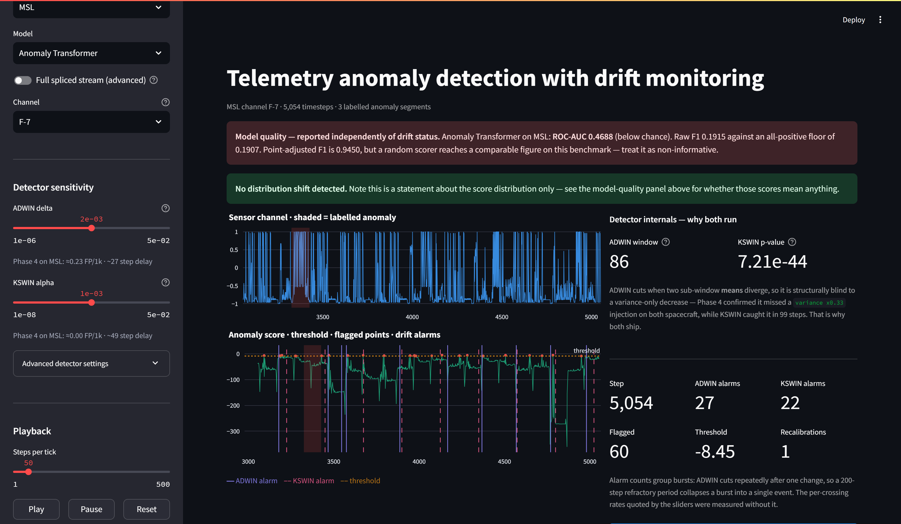

# Multivariate Time-Series Anomaly Detection with Streaming Drift Monitoring

A from-scratch reimplementation of **Anomaly Transformer** (Xu et al., ICLR 2022) on NASA SMAP/MSL
spacecraft telemetry, with an **ADWIN + KS drift-monitoring layer** and a **live Streamlit dashboard**
that replays the test set as a simulated stream.

It reproduces the paper's published SMAP number almost exactly — and then shows that number is
close to meaningless.

---

## The headline finding

| | Point-adjusted F1 on SMAP |
|---|---|
| Anomaly Transformer (published, Xu et al. 2022) | 0.9669 |
| **This reimplementation** | **0.9657** |
| **A uniform random scorer, same labels, same code** | **0.9640** |

The metric that produces the published state of the art cannot distinguish a trained transformer
from `numpy.random.random()`.

Point adjustment credits an *entire* ground-truth anomaly segment as detected if any single
timestep inside it is flagged. With ~12% of SMAP timesteps anomalous and segments averaging 146
steps, near-random flagging hits almost every segment. This reproduces the critique in
Kim et al. (2022) on this exact benchmark, with the point-adjustment logic verified against a
verbatim transcription of the reference implementation's loop across 25 random seeds.

**So this repo leads with raw F1 and ROC-AUC.** Point-adjusted F1 is reported only next to the
random-scorer control.

---



*The dashboard on MSL. The **red** strip reports the model is below chance; the **green** banner
below it reports no drift. Both are true at once — which is the point. Drift monitoring watches the
score distribution and never sees a label, so it cannot tell you whether a model works. Most
monitoring dashboards blur those two signals together; this one keeps them structurally separate.*

---

## Results

AUC is computed **pre-adjustment** on continuous scores — point adjustment rewrites binary
predictions at a chosen threshold, so applying it to a ranking metric would be meaningless.

### SMAP — 427,600 timesteps, 12.79% anomalous, 53 channels

| Model | Raw F1 | ROC-AUC | PR-AUC | PA F1 | inflation |
|---|---|---|---|---|---|
| **Anomaly Transformer** | **0.2439** | **0.5343** | **0.1385** | 0.9657 | 3.96× |
| Ablation: reconstruction only | 0.2268 | 0.3986 | 0.1176 | 0.7099 | 3.13× |
| LSTM-AE baseline | 0.2268 | 0.4575 | 0.1138 | 0.7082 | 3.12× |
| *Random (uniform)* | *0.2268* | *0.5005* | *0.1280* | *0.9640* | *4.25×* |
| *All-positive (trivial)* | *0.2268* | *0.5000* | *0.1279* | *0.2268* | *1.00×* |

### MSL — 73,700 timesteps, 10.54% anomalous, 27 channels

| Model | Raw F1 | ROC-AUC | PR-AUC | PA F1 | inflation |
|---|---|---|---|---|---|
| Anomaly Transformer | 0.1915 | 0.4688 | 0.0973 | 0.9450 | 4.93× |
| Ablation: reconstruction only | 0.2201 | 0.5930 | 0.1479 | 0.7145 | 3.25× |
| **LSTM-AE baseline** | **0.2684** | **0.6301** | **0.1561** | 0.8861 | 3.30× |
| *Random (uniform)* | *0.1908* | *0.4984* | *0.1052* | *0.9067* | *4.75×* |
| *All-positive (trivial)* | *0.1907* | *0.5000* | *0.1054* | *0.1907* | *1.00×* |

Both models share one training loop, one train/val split, one scoring path and one
point-adjustment implementation, so the comparison cannot be an artifact of differing eval code.

---

## Three honest findings

**1. The Anomaly Transformer loses to a plain LSTM autoencoder on MSL.**
Raw F1 0.1915 vs 0.2684; ROC-AUC 0.4688 vs 0.6301. Its ROC is *below chance*. It "wins" only on
the inflated metric (0.9450 vs 0.8861).

**2. The paper's association mechanism helps on one dataset and hurts on the other.**
Against the reconstruction-only ablation of the same weights: SMAP ROC 0.3986 → 0.5343 (**+0.136**),
MSL 0.5930 → 0.4688 (**−0.124**). The central idea contributes real signal on SMAP and actively
destroys it on MSL.

Reconstruction-only on SMAP scores **0.3986 ROC — worse than chance**, meaning anomalous timesteps
are reconstructed *better* than normal ones. SMAP anomalies are largely flatlines and sustained
level shifts, which an autoencoder finds trivially easy, while normal telemetry is spiky.

**3. Drift monitoring cannot substitute for a model-quality signal.**

| MSL score stream | ROC-AUC | ADWIN delay | ADWIN FP/1k | KSWIN delay |
|---|---|---|---|---|
| Anomaly Transformer | 0.4688 (below chance) | 5 | 0.23 | 49 |
| LSTM-AE baseline | 0.6301 | 4 | 1.52 | 49 |

Near-identical drift behaviour across a 0.16 AUC gap spanning "worse than random" to "modestly
useful". Expected — the detector only ever sees the score distribution, never a label — but it
means a green "no drift" banner carries zero information about whether the model works. The
dashboard therefore shows model quality as a **separate, always-visible** element; the screenshot
at the top of this README is that case in practice.

---

## Drift detection

Two detectors run together, because they fail differently.

**False positives** on i.i.d. clean data (100k steps, reference drawn from the same pool):

| | SMAP | MSL |
|---|---|---|
| ADWIN (δ = 0.002) | 0.660 / 1000 | 0.230 / 1000 |
| KSWIN (α = 1e-3) | 0.020 / 1000 | 0.000 / 1000 |

**Detection delay** on a stationary base with a shift injected at the midpoint:

| Injected shift | ADWIN SMAP | KSWIN SMAP | ADWIN MSL | KSWIN MSL |
|---|---|---|---|---|
| offset +0.5 sd | 104 | 124 | 201 | 49 |
| offset +1.0 sd | 25 | 74 | 27 | 49 |
| offset +2.0 sd | 8 | 49 | 5 | 49 |
| offset −1.0 sd | 29 | 49 | 37 | 49 |
| variance ×3 | 110 | 99 | 18 | 49 |
| **variance ×0.33** | **missed** | 99 | **missed** | 49 |
| splice (other craft) | 88 | 74 | missed | 49 |

**ADWIN is structurally blind to a variance decrease.** It cuts when two sub-window *means*
diverge; shrinking the spread at constant mean makes them converge, so there is nothing to cut on.
KSWIN compares full empirical CDFs and catches it. That is why both ship.

### A note on the raw benchmark stream

On the concatenated test stream both detectors fire constantly — **ADWIN ~56, KSWIN ~40 alarms per
1000 steps** — against 0.66 and 0.02 on stationary data. They are right to: the benchmark splices
53 unrelated channels end to end, so there genuinely is a distribution change every few thousand
steps. This is an artifact of how the benchmark was assembled, not model instability. The dashboard
defaults to a single continuous channel and explains this when the spliced view is selected.

---

## What's different from the paper

| | Paper / reference implementation | Here |
|---|---|---|
| Data | Preprocessed `.npy` arrays of unclear provenance | Rebuilt from NASA's raw per-channel release, **verified bit-exact** against the published arrays |
| Validation | Validates on the **test set** | Chronological split **within each channel** |
| Headline metric | Point-adjusted F1 | Raw F1 + ROC-AUC, with a random-scorer control |
| Baseline | — | LSTM-AE through an identical training and eval path |
| Drift | — | ADWIN + KSWIN with measured FP rate and delay |
| Precision | fp32 | bf16 autocast, fp32-guarded KL |

### Reconstructing the benchmark

Rebuilding the concatenated arrays from NASA's raw telemanom release surfaced two undocumented
quirks that every paper using this dataset silently inherits:

1. `labeled_anomalies.csv` ships a **duplicate row for channel `P-2`**.
2. The published pipeline **drops `P-2` entirely** and splices channels in **lexicographic** order
   (`D-11` before `D-2`), not CSV row order.

So SMAP is 55 CSV rows → 54 unique → **53 channels** in the actual benchmark. With those two
corrections all six arrays match the published ones bit-for-bit (`max|diff| = 0`), labels included.

### Engineering notes worth reading

- **Score underflow.** The anomaly score is `softmax(−series−prior) × rec_err`. At temperature 50
  with KL ≈ 16 over 3 layers, the logits span hundreds of nats, the softmax saturates, and **70.06%
  of SMAP scores underflowed to exactly 0.0** in fp32 — capping attainable recall at 0.33. Fixed by
  computing `log_softmax + log(rec_err)`, a strictly monotone transform that leaves ranking metrics
  unchanged in exact arithmetic.
- **bf16, not fp16.** SMAP feature 10 is a command flag firing ~once in 108k steps, so its z-score
  reaches **328.9**; 9 of 25 features exceed |z| > 50. fp16 overflows at 65504 once squared,
  producing intermittent NaN from ~step 500. bf16 has fp32's exponent range and runs at the same
  speed on `sm_89`.
- **Association-matrix memory.** The `(B, H, L, L)` tensors dominate VRAM (~20× everything
  parametric). Hoisting the prior normalization, broadcasting `distances`, precomputing its square,
  and collapsing the reference's two backward passes into one brings a full Config-A training step
  to **0.93 GB** on an 8 GB card. Note `d_model` does not appear in `B × H × L² × layers` — shrinking
  it buys zero association headroom.
- **ADWIN refractory period.** ADWIN cuts once per step after a change, so one event surfaces as a
  burst (115 alarms in 2900 steps). A time-based cooldown collapses that to 14 — but silently
  *swallowed* genuine second events inside the window, so suppression is conditional on the window
  mean not having moved beyond 3σ of its level at the last alarm.

---

## Model

Config A, chosen after measuring rather than guessing:

| | |
|---|---|
| `d_model` / `n_heads` / `e_layers` / `d_ff` | 512 / 8 / 3 / 512 |
| `win_size` / `batch_size` | 100 / 64 |
| Parameters | 4,798,513 (SMAP) · 4,859,983 (MSL) |
| LSTM-AE baseline | 4,189,081 (SMAP) · 4,246,711 (MSL) |
| Peak VRAM | 0.97 GB of 8 GB |
| Training | ~7 min SMAP, ~3 min MSL (3 epochs, RTX 4060 Laptop) |

---

## Dashboard

```bash
python -m streamlit run app/streamlit_app.py
```

Replays precomputed scores as a simulated live stream — no GPU needed at demo time.

- **Model quality** as its own always-visible strip, never folded into drift status
- **Dual detectors** on one chart (ADWIN solid, KSWIN dashed) with a live internals panel
- **Sensitivity sliders** snapped to the swept values, each showing its *measured* FP rate and delay
- **Manual recalibration** — drift latches the flag; the operator clicks; threshold and KS reference
  both move

---

## Running it

```bash
pip install -r requirements.txt

python scripts/01_download_data.py        # ~330 MB, gitignored
python scripts/02_inspect_and_plot.py     # verify rebuild is bit-exact
python scripts/03_memory_probe.py         # measure VRAM before training
python scripts/04_train.py --spacecraft SMAP
python scripts/05_evaluate.py --spacecraft SMAP
python scripts/06_drift.py --sweep
python scripts/07_prepare_dashboard.py
python -m streamlit run app/streamlit_app.py

python scripts/08_capture_dashboard_figure.py   # regenerate the figure above

pytest tests -q                           # 156 tests
```

Requires CUDA for training; the dashboard does not.

---

## Layout

```
app/streamlit_app.py          dashboard
src/mtsad/
  data/                       telemanom parsing, windowing, bit-exact verification
  models/                     Anomaly Transformer, LSTM-AE, losses, VRAM probe
  eval/                       point adjustment, raw + adjusted F1, AUC
  drift/                      ADWIN, KSWIN, injection + measurement harness
  dashboard/                  stream slicing, replay state, Phase 3/4 lookups
scripts/                      01-08, numbered in execution order
tests/                        156 tests
reports/                      committed result JSON
docs/                         committed figures
```

---

## References

- Xu et al., *Anomaly Transformer: Time Series Anomaly Detection with Association Discrepancy*, ICLR 2022
- Hundman et al., *Detecting Spacecraft Anomalies Using LSTMs and Nonparametric Dynamic Thresholding*, KDD 2018
- Kim et al., *Towards a Rigorous Evaluation of Time-series Anomaly Detection*, AAAI 2022
- Bifet & Gavaldà, *Learning from Time-Changing Data with Adaptive Windowing*, SDM 2007
